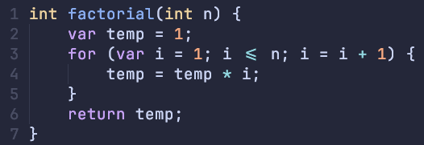

# Tree Sitter Parser for Oat

This provides syntax highlighting for oat in editors



## Installation

### Neovim

Just run the install script (which just copies a bunch of files to ~/.config/nvim)

```sh
$ ./install-neovim.sh
```


An example of how to setup the filetype detection is in
[editors/nvim/oat.lua](./editors/nvim/oat.lua).

### Emacs
- Requirements
    - An Emacs build with tree-sitter support (you can check with `(treesit-available-p)`)
    - [tree-sitter](https://emacs-tree-sitter.github.io/)
    - [tree-sitter-langs](https://github.com/emacs-tree-sitter/tree-sitter-langs) 
It seems the intended installation would be:
- `M-x treesit-install-language-grammar`
- enter the URL to this repo: https://github.com/HSMF/tree-sitter-oat.git and accept the default choices

For me this did not work (Doom Emacs 29.1) and wrote this install script (you may need to tweak it for your system/distribution).
```sh
bash install-emacs.sh
```
- Add to your `config.el`:
We need to define a major-mode for the oat language.
```emacs-lisp
;; We can optionally define our own font-lock rules
;; tree-sitter-hl-mode also uses the default queries provided in queries/highlights.scm
(setq oat-ts-font-lock-rules
      '(:language oat
        :override t
        :feature comment
        ((comment) @font-lock-comment-face)))

(defun oat-ts-setup ()
  (interactive)
  "Setup treesit for oat-mode."
  (setq-local treesit-font-lock-settings
              (apply #'treesit-font-lock-rules
                     oat-ts-font-lock-rules))
  (setq-local treesit-font-lock-feature-list
              '((comment decl fdecl id arg ) ;; Can add more features here
                (bop keyword) ;; You can write a font-lock rule for a feature by adding a block to oat-ts-font-lock-rules
                (type retty boolean integer)))
  ;; How many sublists of treesit-font-lock-feature-list we want
  ;; This allows us to choose a /granularity/ of highlighting
  (setq-local treesit-font-lock-level 3)
  ;; TODO Indentation rules
  ;; (setq-local treesit-simple-indent-rules oat-ts-indent-rules)
  (treesit-major-mode-setup))

(define-derived-mode oat-mode prog-mode "oat" "A mode for the oat language which is mainly used for the compiler design course."
  (when (treesit-ready-p 'oat)
    (treesit-parser-create 'oat)
    (oat-ts-setup))
    (tree-sitter-hl-mode))
```

Instruct emacs to use `oat-mode` for `*.oat` files:
```emacs-lisp
(add-to-list 'auto-mode-alist '("\\.oat\\'" . oat-mode))
(after! tree-sitter
  (add-to-list 'tree-sitter-major-mode-language-alist '(oat-mode . oat)))
```

- Test if the grammar is available. Should return `t`
```emacs-lisp
(treesit-language-available-p 'oat)
```
You should now be able to open `examples/factorial.oat` and have syntax highlighting :)

- References
    - <https://www.masteringemacs.org/article/how-to-get-started-tree-sitter>
    - <https://tree-sitter.github.io/tree-sitter/>
    - <https://git.savannah.gnu.org/cgit/emacs.git/tree/admin/notes/tree-sitter/starter-guide?h=feature/tree-sitter>
